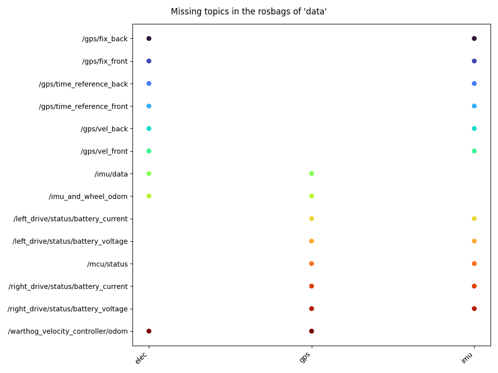

# rosbag-compare

> Compare the topic content between rosbags

Say you have a bunch of rosbags inside a folder and you don't know whether or not all those rosbags have the same topics. `rosbag-compare` will :

* retrieve the topics contained in each rosbag
* export a summary of the ros topics in a JSON file
* plot the topics that are missing for each rosbag :



## Installation

`rosbag-compare` can be installed from PyPi :

```console
$ pip install rosbag-compare
```

## Usage

`rosbag-compare` can be used both as a command line application and in Python code.

### Command line

A basic use of `rosbag-compare` is to simply call it with the path of the folder that contains rosbags. This will simply generate a JSON file with a summary of the comparison in `topics_<name-of-bagfolder>.json`.

```console
$ rosbag-compare -b /path/to/folder/with/rosbags
```

You can also generate a figure that will show what topics are missing in each rosbag with the `--plot/-p` flag. This figure helps when you want to find out if all rosbags of your experiment contains the topics that are of your interest.

```console
$ rosbag-compare -b /path/to/folder/with/rosbags -p
```

### In Python

You can also call `rosbag-compare` directly into your Python code :

```py
from rosbag_compare import RosbagComparator

data_path = "/path/to/folder/with/rosbags"
rbag_comp = RosbagComparator(data_path)

# This step may take time as it open each rosbag separately
# Will show a progress bar
rbag_comp.extract_data()

# Export summary to a JSON file
rbag_comp.to_json()  # Defaults to topics_<foldername>.json
rbag_comp.to_json("exported_summary.json")

# Generate a figure with the name of the
# missing topics for each rosbag
rbag_comp.plot()                                              # Show figure
rbag_comp.plot(save_fig=True)                                 # Save figure (defaults to missing_topics.png)
rbag_comp.plot(save_fig=True, img_path="topics_summary.jpg")  # Save figure to path
```

## Contributing

Pull requests are welcome and don't hesitate to open issues

Development requirements can be installed using pip :

```console
$ python -m venv venv
$ source venv/bin/activate
$ pip install -r requirements/requirements-dev.txt
```

## License

This project is licensed under a [MIT](LICENSE) license
